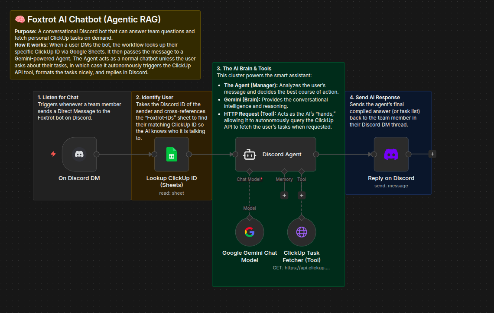
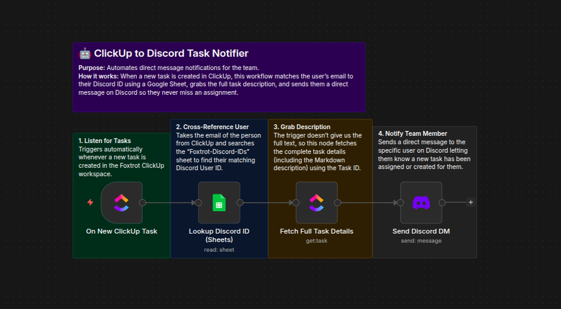
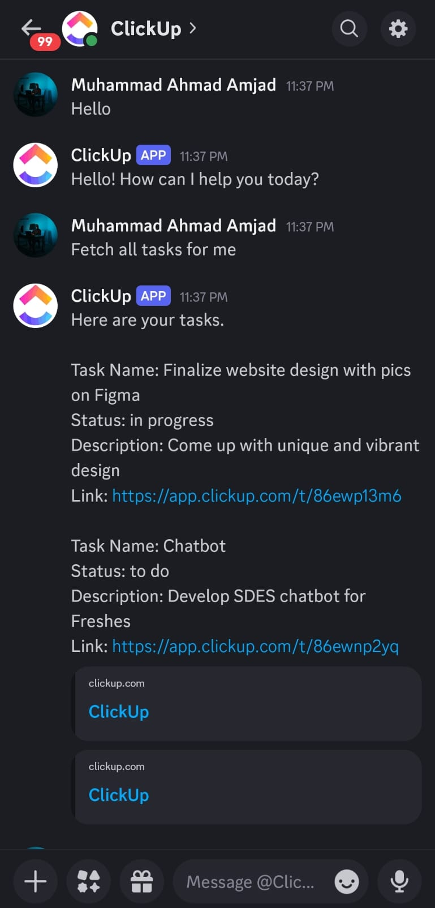
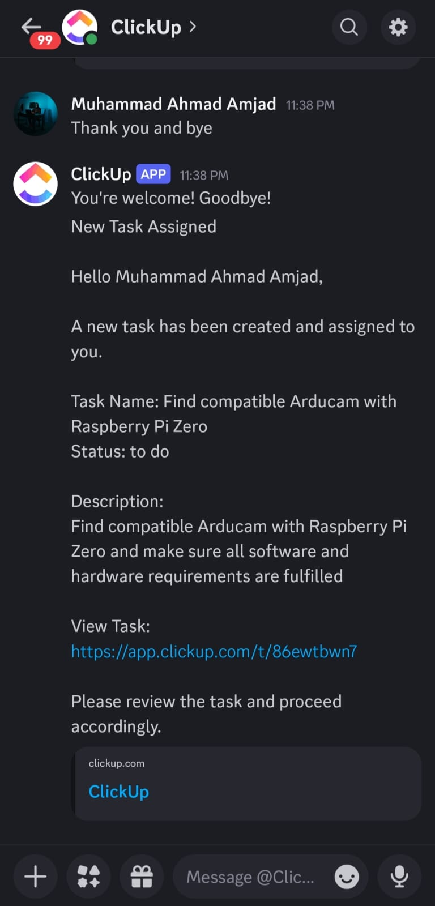

# Foxtrot ClickUp-Discord Integration

A comprehensive n8n automation solution that bridges ClickUp task management with Discord communication for Team Foxtrot. This integration enables team members to access their ClickUp tasks directly through Discord and receive instant notifications when new tasks are assigned.

## Overview

This project contains two n8n workflows designed to streamline task management and team communication:

| Workflow | Purpose |
|----------|---------|
| **Discord Bot Agent** | AI-powered chatbot for fetching tasks and general assistance |
| **Task Creation Notifier** | Automatic Discord notifications for new task assignments |

## Features

- **AI-Powered Chatbot**: Team members can DM the bot to ask questions or request their ClickUp tasks
- **Automatic Task Notifications**: Instant Discord DMs when new tasks are created and assigned
- **User Identity Mapping**: Google Sheets integration to map Discord users to ClickUp accounts
- **Natural Conversations**: The bot handles general queries while seamlessly integrating task management

---

## Workflow 1: Discord Bot Agent (Agentic RAG)

An intelligent conversational Discord bot powered by Google Gemini that can answer team questions and fetch personal ClickUp tasks on demand.

### How It Works



1. **Listen for Chat** - Triggers whenever a team member sends a Direct Message to the Foxtrot bot on Discord

2. **Identify User** - Takes the Discord ID of the sender and cross-references the "Foxtrot-IDs" Google Sheet to find their matching ClickUp ID

3. **The AI Brain & Tools**
   - **The Agent (Manager)**: Analyzes the user's message and decides the best course of action
   - **Gemini (Brain)**: Provides the conversational intelligence and reasoning
   - **HTTP Request (Tool)**: Acts as the AI's "hands," allowing it to autonomously query the ClickUp API to fetch the user's tasks when requested

4. **Send AI Response** - Sends the agent's compiled answer (or formatted task list) back to the team member in their Discord DM

### Components Used

| Component | Purpose |
|-----------|---------|
| Discord Trigger | Listens for incoming DMs |
| Google Sheets | User identity mapping (Discord ID → ClickUp ID) |
| Google Gemini | AI language model for conversation |
| n8n Agent | Orchestrates the AI workflow |
| HTTP Request Tool | Fetches tasks from ClickUp API |
| Discord | Sends response messages |

---

## Workflow 2: Task Creation Notifier

Automates direct message notifications to team members whenever a new task is created and assigned to them in ClickUp.

### How It Works



1. **Listen for Tasks** - Triggers automatically whenever a new task is created in the Foxtrot ClickUp workspace

2. **Cross-Reference User** - Takes the email of the person from ClickUp and searches the "Foxtrot-Discord-IDs" Google Sheet to find their matching Discord User ID

3. **Grab Description** - Fetches the complete task details (including the Markdown description) using the Task ID, since the trigger doesn't provide full text

4. **Notify Team Member** - Sends a direct message to the specific user on Discord with:
   - Task name
   - Current status
   - Full description
   - Direct link to the task in ClickUp

### Notification Format

```
New Task Assigned

Hello [Username],

A new task has been created and assigned to you.

Task Name: [Task Name]
Status: [Status]

Description:
[Task Description]

View Task:
https://app.clickup.com/t/[TaskID]

Please review the task and proceed accordingly.
```

### Components Used

| Component | Purpose |
|-----------|---------|
| ClickUp Trigger | Listens for new task creation events |
| Google Sheets | User identity mapping (Email → Discord ID) |
| ClickUp | Fetches full task details |
| Discord | Sends DM notifications |

---

## Prerequisites

### Required Services

- **n8n** - Workflow automation platform
- **Discord Bot** - With appropriate permissions
- **ClickUp Workspace** - Team workspace with API access
- **Google Sheets** - For user identity mapping
- **Google Cloud API** - For Gemini AI (Discord Bot Agent only)

### Required Credentials

1. **Discord Bot API** - Bot token with message sending permissions
2. **Discord Bot Trigger API** - For receiving DM events
3. **ClickUp API** - Personal or workspace API token
4. **Google Sheets OAuth2** - For reading user mapping sheets
5. **Google Gemini API** - For AI conversations (Discord Bot Agent only)

### Google Sheets Setup

You need two Google Sheets for user identity mapping:

**Sheet 1: Foxtrot-IDs** (for Discord Bot Agent)
| Discord User ID | Click Up ID |
|-----------------|-------------|
| 123456789012345 | 12345678    |

**Sheet 2: Foxtrot-Discord-IDs** (for Task Notifier)
| Email | Discord User ID |
|-------|-----------------|
| user@foxtrot.com | 123456789012345 |

---

## Installation

1. **Import Workflows**
   - Open your n8n instance
   - Go to Workflows → Import from File
   - Import `Discorbot_agent.json` for the AI chatbot
   - Import `TaskCreation.json` for task notifications

2. **Configure Credentials**
   - Set up all required credentials in n8n
   - Update the Google Sheets document IDs in each workflow
   - Update the ClickUp team/workspace IDs

3. **Update User Mapping**
   - Populate Google Sheets with team member Discord IDs, ClickUp IDs, and emails

4. **Activate Workflows**
   - Test each workflow with sample data
   - Activate workflows for production use

---

## Examples

### Discord Bot Agent in Action

The AI chatbot responding to a user query and fetching their ClickUp tasks:



### Task Creation Notification

Automatic notification received when a new task is assigned:



---

## Configuration Notes

- The Discord Bot Agent uses regex pattern `.*` to capture all incoming DMs
- Task notifications are triggered only for `taskCreated` events
- The AI agent's system prompt can be customized to adjust bot personality and behavior
- Both workflows use the same Discord bot account for consistent user experience

---

## License

This project is licensed under the MIT License - see the [LICENSE](LICENSE) file for details.

---

## Author

Created for **Team Foxtrot** to enhance productivity and streamline communication between ClickUp and Discord.
